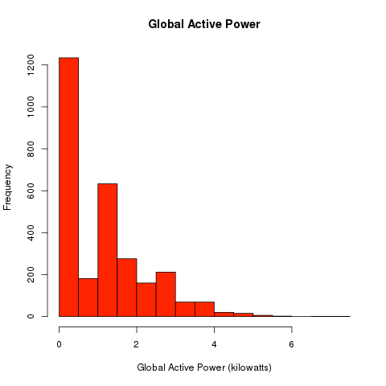
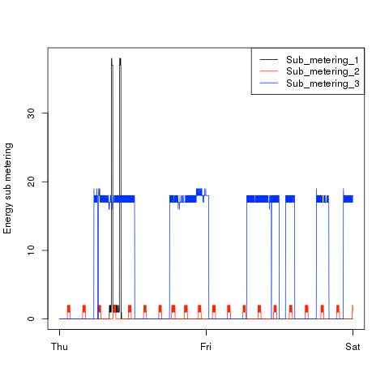
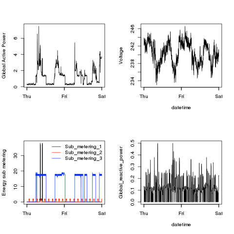

# Compare reference images to generated images.
## Note the tables's non-white background color - check for transparent images.

<table style="background-color:#E6E6FA; border: 1px solid black;">

<tr>
<th>Reference Plots</th>
<th>Generated Plots</th>
</tr>

<tr>
<td style="background-color:#E6E6FA; border: 1px solid black;"></td>
<td style="background-color:#E6E6FA; border: 1px solid black;"></td>
</tr>

<tr>
<td style="background-color:#E6E6FA; border: 1px solid black;"></td>
<td style="background-color:#E6E6FA; border: 1px solid black;"></td>
</tr>

<tr>
<td style="background-color:#E6E6FA; border: 1px solid black;"></td>
<td style="background-color:#E6E6FA; border: 1px solid black;"></td>
</tr>

<tr>
<td style="background-color:#E6E6FA; border: 1px solid black;"></td>
<td style="background-color:#E6E6FA; border: 1px solid black;"></td>
</tr>

</table>

That's all folks
